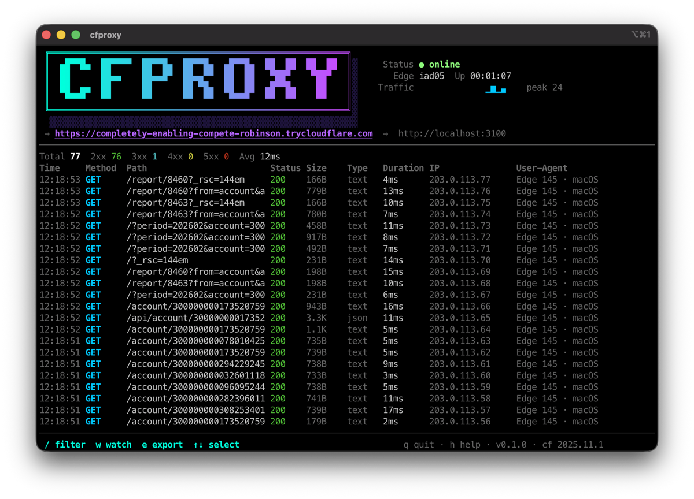

# cfproxy

Expose localhost to the internet with a full HTTP debugger in your terminal.

Built on Cloudflare Tunnels. Single binary. No account required.



## Features

| | |
|---|---|
| Per-request inspection | Live headers, body, timing, IP, user agent |
| Request replay | Replay to localhost or back through the tunnel |
| Request diff | Mark two requests, compare side by side |
| Mock responses | Stub endpoints from the CLI |
| HAR export | Export traffic for browser devtools |
| cURL export | Copy any request as a cURL command |
| Custom domains | Your own domain with wildcard subdomains |
| HTTP Basic Auth | Protect your tunnel with `--auth` |
| WebSocket support | Inspect WS frames in real time |
| QR codes | Scan to test on mobile instantly |
| Auto cloudflared | Downloads and caches `cloudflared` for you |

## Install

### From source (recommended)

```bash
brew install rust        # if you don't have Rust/Cargo yet
cargo install cfproxy
cfproxy 3000
```

### From release binaries

Download a prebuilt binary from [Releases](https://github.com/gitrc/cfproxy/releases). On macOS, you'll need to remove the quarantine flag since the binary isn't signed:

```bash
xattr -d com.apple.quarantine cfproxy
```

### Build from source

```bash
git clone https://github.com/gitrc/cfproxy.git
cd cfproxy
cargo build --release
# Binary is at target/release/cfproxy
```

## Quick Start

### Free mode (no account needed)

```bash
cfproxy 3000
```

Uses your existing `cloudflared` or downloads it automatically, creates a tunnel to `localhost:3000`, and gives you a public `trycloudflare.com` URL with a live request dashboard.

### Custom domain (free Cloudflare account)

```bash
cfproxy --setup              # one-time: walks you through API token, account, zone, tunnel
cfproxy --host myapp 3000    # tunnel on myapp.yourdomain.com
```

Run multiple services simultaneously — each `--host` gets its own subdomain on your domain, all sharing one tunnel.

## Why cfproxy

As of March 2026, tools like [ngrok](https://ngrok.com), [bore](https://github.com/ekzhang/bore), [ytunnel](https://github.com/yetidevworks/ytunnel), and [tuinnel](https://github.com/NickDunas/tuinnel) each cover tunneling well, but none give you full per-request HTTP inspection in the terminal. ytunnel and tuinnel show aggregate Prometheus metrics only. ngrok has a web inspector, but locks replay and auth behind paid tiers.

cfproxy is the only free tool that combines tunneling with a terminal HTTP debugger:

- **Per-request inspection** — see every request's headers, body, timing, IP, and user agent live
- **Request replay** — replay any captured request to localhost or back through the tunnel
- **Request diff** — mark two requests and compare them side by side
- **Mock responses** — stub endpoints from the CLI without touching your server (`--mock "/api/health:200"`)
- **HAR export** — export captured traffic for use with browser devtools or other tools
- **cURL export** — copy any request as a ready-to-run cURL command
- **Custom domains** — use your own domain with wildcard subdomains, free via Cloudflare
- **QR code** — scan with your phone to test on mobile instantly

All in a single Rust binary with no runtime dependencies.

## Key Bindings

### Request List

| Key | Action |
|-----|--------|
| `j` / `k` / Up / Down | Navigate requests |
| `Enter` | Open request detail |
| `c` | Copy tunnel URL to clipboard |
| `C` | Copy selected request as cURL |
| `e` | Export requests to HAR file |
| `/` | Filter requests by path, method, status, type, IP, or user agent |
| `Space` | Mark request (for diff) |
| `d` | Diff marked vs selected request |
| `w` | Watch / unwatch selected path |
| `s` | Show QR code |
| `S` | Open settings |
| `h` | Show help |
| `q` | Quit |

### Request Detail

| Key | Action |
|-----|--------|
| `Tab` / `l` / Right | Next tab (Request / Response / Info / WS Frames) |
| `Shift+Tab` / `H` / Left | Previous tab |
| `c` | Copy request as cURL |
| `r` | Replay request to localhost |
| `R` | Replay request to tunnel URL |
| `m` | Mock this endpoint |
| `j` / `k` / Up / Down | Scroll |
| `Esc` / `Backspace` / `q` | Back to list |

## CLI

| Flag | Env Variable | Description |
|------|-------------|-------------|
| `<PORT>` | -- | Local port to expose |
| `--auth <USER:PASS>` | `CFPROXY_AUTH` | Enable HTTP Basic Auth |
| `--mock <SPEC>` | `CFPROXY_MOCK` | Mock response (`[METHOD] /path:status[:body]`), repeatable |
| `--host <NAME>` | `CFPROXY_HOST` | Custom subdomain (requires `--setup` first) |
| `--quick` | `CFPROXY_QUICK` | Force quick tunnel mode |
| `--setup` | -- | Interactive setup wizard for custom domains |
| `--doctor` | -- | Run diagnostic checks |
| `--purge` | -- | Clean stale tunnels and DNS records |
| `--update` | -- | Update cached cloudflared binary to latest |
| `--cloudflared-path <PATH>` | `CFPROXY_CLOUDFLARED_PATH` | Path to `cloudflared` binary |
| `--no-download` | `CFPROXY_NO_DOWNLOAD` | Disable automatic `cloudflared` download |
| `--cache-dir <DIR>` | `CFPROXY_CACHE_DIR` | Cache directory for `cloudflared` binary |
| `--version` | -- | Print version |

## Development

```bash
make build     # Build release binary
make test      # Run all tests
make lint      # Run clippy lints
make fmt       # Format code
make run PORT=3000  # Run locally
RUST_LOG=debug cargo run -- 3000  # Debug logging
```

## License

[MIT](LICENSE)
